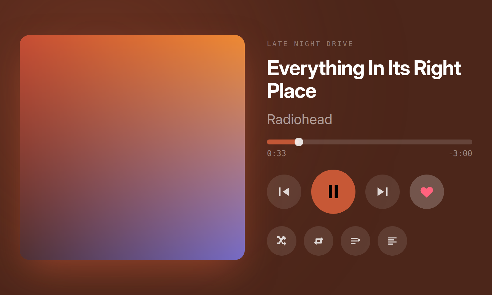

# Cassette

An Apple Music player for the Spotify Car Thing, built on
[BridgeThing](https://github.com/JoeyEamigh/bridgething).

BridgeThing ships Spotify's stock interface. If you use Apple Music, there is
nothing equivalent — this fills that gap. It is built for glancing at while
driving: large targets, big type, and no control small enough to need aiming.



## What it does

- **Now playing** with artwork, an ambient tint sampled from the cover, and
  transport
- **Time-synced lyrics** at 38px, three lines at a time
- **A draggable scrubber** — tap or drag anywhere on the bar
- **Four radio presets** on the physical buttons: tap to play a playlist
  shuffled, hold to save the one you are on
- **Playlist browsing** — your playlists, Made For You, and recently played
- **Up next**, ordered from the track you are on
- **Diagnostics**, because the failure modes below are hard to see otherwise

## Controls

| Control | Does |
| --- | --- |
| Presets 1–4 | Tap plays that preset shuffled; hold ~0.7s saves what is playing |
| Mode | Toggles the lyrics view |
| Back | Opens Music / Up next / More |
| Rotary wheel | Volume on the player, scrolls any list |
| Touch | Everything, including scrubbing |

## Install

Two ways, both from the phone — no cable, no build step.

**From the app directory.** Add this repo as a source in the BridgeThing
companion app:

```
https://raw.githubusercontent.com/imCylo/Cassette---Apple-Music-App-for-CarThing/main/catalog.json
```

Updates then show up on their own.

**By hand.** Download
[`releases/Cassette-0.8.0.zip`](releases/Cassette-0.8.0.zip) and install it from
the companion app.

## Build it yourself

```bash
bun install
bun run dev        # http://localhost:5173
bun run build      # production bundle into dist/
bun run share      # Cassette-<version>.zip, installable from the companion app
bun run check-id   # verify the webapp id has not drifted (build runs this too)
bun run push       # build + install onto a Car Thing over USB
bun run catalog    # regenerate catalog.json from public/manifest.json + releases/
```

### Cutting a release

The catalog's `sha256` is verified before a bundle reaches a device, and the zip
embeds file mtimes, so rebuilding after generating the catalog invalidates it
even if nothing changed. Order matters:

```bash
bun run build && bun run share
mv Cassette-<version>.zip releases/
bun run catalog          # hashes what is on disk, validates the document
git add -A && git commit && git push
```

The download URLs point at `raw.githubusercontent.com` rather than GitHub
Release assets: the directory reads the catalog from a browser, so every URL in
it needs `Access-Control-Allow-Origin: *`, and release assets redirect to a host
that does not promise it. The icon is a PNG for a related reason — Raw serves
`.svg` as `text/plain` with `nosniff`, which browsers refuse to render.

### Developing without hardware

`scripts/mockd.ts` is a stand-in for the on-device daemon. It speaks the real
wire protocol — the client accepts JSON text frames as well as msgpack — and
serves a fabricated track with synced lyrics, artwork, playlists and a queue.

```bash
bun scripts/mockd.ts
VITE_BRIDGETHING_URL=ws://127.0.0.1:8891/ bun run dev
```

It can also reproduce the states that are hard to catch on real hardware:

| Flag | Reproduces |
| --- | --- |
| `--iap2` | artwork pushed late, no playback context |
| `--am-broken-art` | an Apple Music art id whose gateway lane always misses |
| `--starved` | an iAP2 art id that never arrives at all |
| `--youtube` | another app owning the audio session |
| `--takeover` | a video taking over mid-track |
| `--no-lyrics` / `--plain` | a provider with no lyrics, or unsynced only |
| `--empty` | nothing playing |

`scripts/shoot.ts` and `scripts/measure.ts` drive the app in a headless browser
locked to the device's exact 800×480 and report overflow, clipped text and lyric
centring. Worth running before shipping a layout change.

### The webapp id

`public/manifest.json`'s `id` is this app's identity — BridgeThing installs to
`/var/bridgething/webapps/<id>/` and the companion matches updates against it.
Changing it orphans every copy already installed.

Nothing in the build touches it: vite copies `public/` into `dist/` verbatim, and
`share.ts` and `push.ts` only read the manifest. `bun run check-id` asserts it
anyway, and `bun run build` runs that first, so an accidental edit fails the build
instead of shipping.

## Known BridgeThing limitations this works around

Everything in [`docs/UPSTREAM.md`](docs/UPSTREAM.md) is a limitation found while
building this, with source references. Short version:

- Apple Music artwork often never resolves through the gateway asset lane, so
  Cassette falls back to fetching it from Apple's public catalog
- Apple Music reports no playback context, so presets remember what you last
  started here
- Apple Music has no queue listing, so "Up next" shows the playlist instead
- Which app owns playback is not on the wire, so the "something else is playing"
  screen is a manual switch

Corrections very welcome — several of these are inferences from reading the
BridgeThing source rather than confirmed behaviour, and they were all observed
on one iPhone against one account. Open an issue if your device behaves
differently; that is more useful to me than a thank-you.

## Licence

MIT.
